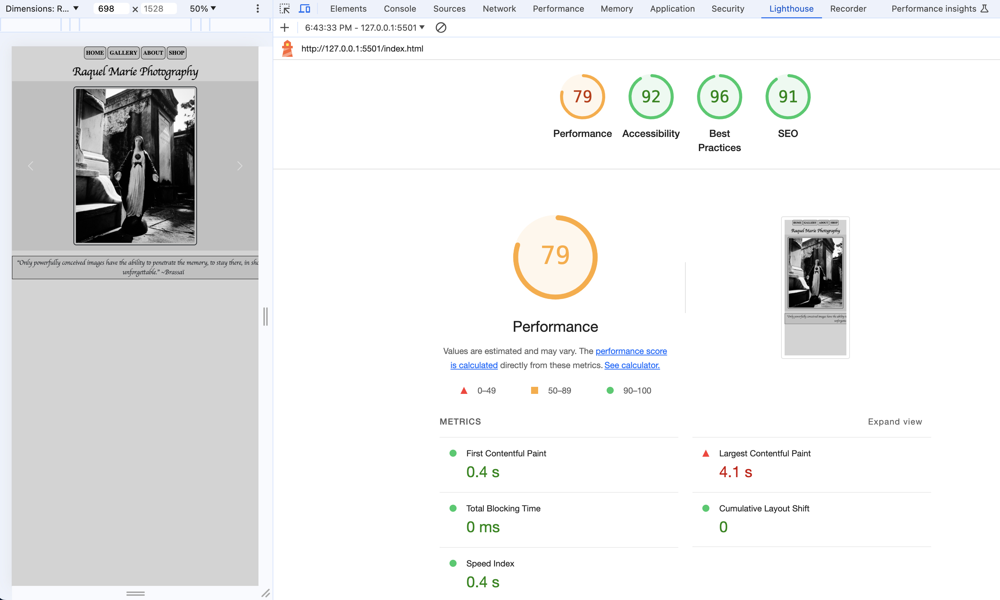
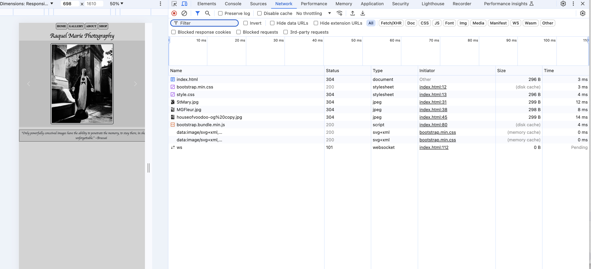
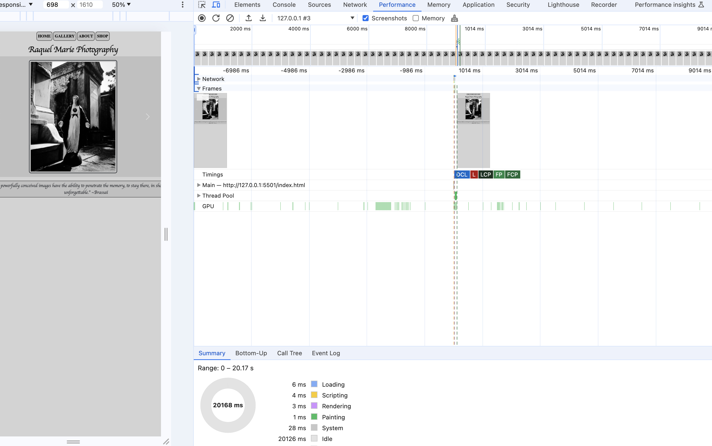
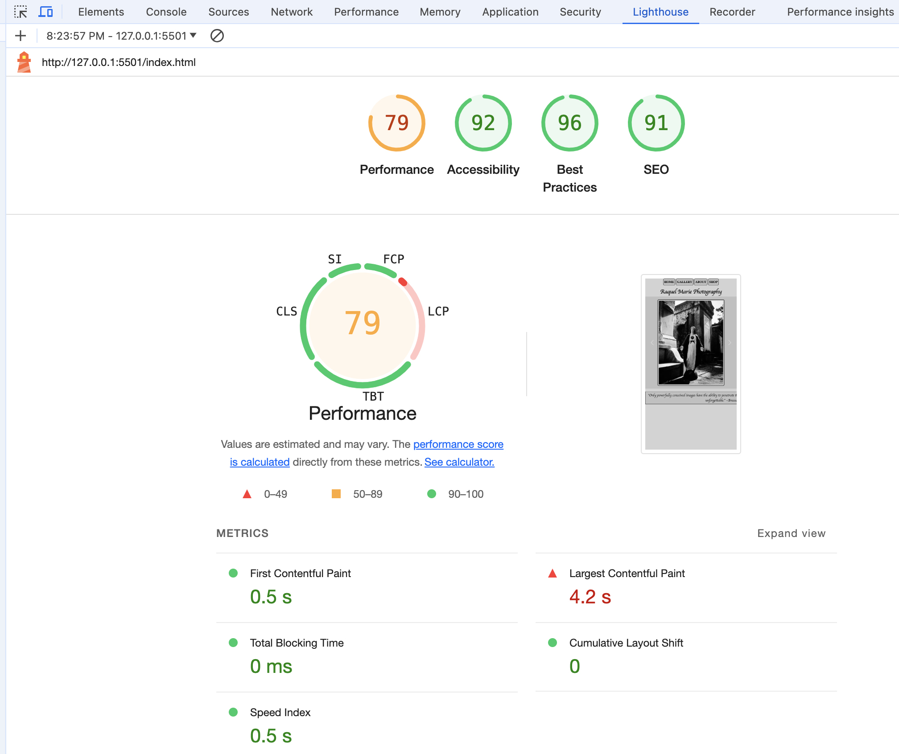

# Day 4
Identified Issues: Image size | 
My overall optimization performance score is good, but the issue is the size of the images, which can be easily remedied in css by adjusting the image height and width to create a smaller file that will upload faster. I could also resize my images in photoshop and drop the adjusted images into the image folder in vs code. Either way would work to optimize the website's performance.

## Part 1

Lighthouse

## Part 2
Network

Performance

